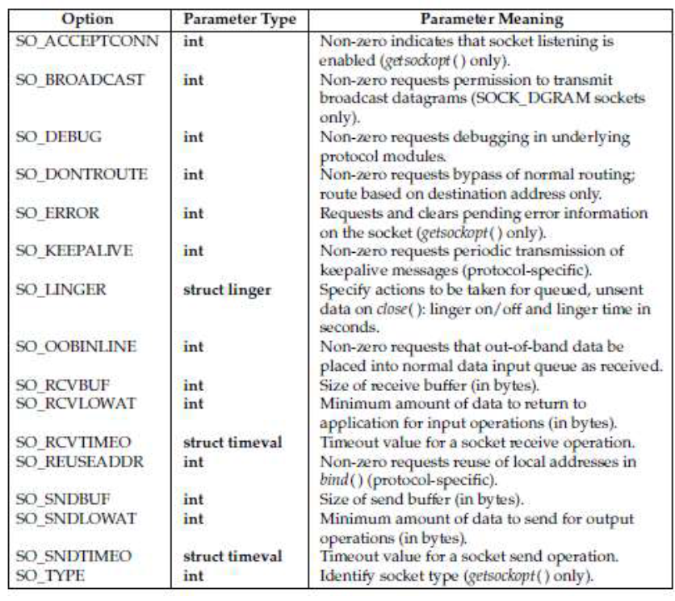

https://www.gnu.org/software/libc/manual/html_node/Socket-Concepts.html

# Sockets - Manpages
## Socket
**Manpages:** man 3p socket, man 7 socket
```c
#include <sys/socket.h>

sockfd = socket(int socket_family, int socket_type, int protocol);
// - socket_family (domain - nazwa confusing) - okresla przestrzen
// w której ma zostać utworzony socket
// - socket_type - określa typ socketa 
// - protocol - określa jaki protokół będzie wykorzystany (protokół ten musi 
// być wspierany przez socket_family), 0 oznacza
// zlecenie wykorzystnia protokołu domyślnego dla danego typu socketu, 
// w danej socket_family

// zwraca deskrytpor pliku, który odwołuje się do
// końcowego punktu komunikacji (-1 w przypadku niepowodzenia)

// możliwe errory: man 3p socket
```

Sockety to jednorodny interfejs pomiędzy procesem użytkownika a stosem protokołu sieciowego umiejscowionego w kernelu.

Wyróżniamy moduły protokołów:
- *protocol families* (*namespace*) - np. AF_INET (przestrzeń Internet IPv4), AF_LOCAL (przestrzeń lokalna), 
- *socket types*: 
  - `SOCK_STREAM` - komunikacja za pomocą strumienia bajtów,
    - podobna do pipe'ów,
    - dwukierunkowa,
    - mamy pewność, że dane dotrą do celu,
  - `SOCK_DGRAM` - komunikacja za pomocą datagramów (pakiety), 
    - każdy datagram musi być zaadresowany, 
    - nie mamy gwarancji (zależy od przestrzeni nazw), że datagramy zostaną dostarczone (musimy czekać na otrzymanie potwierdzenia w określonym czasie, w przeciwny przypadku wysłać ponownie),
    - nie mamy gwrancji w jakiej kolejności datagramy zostaną odebrane,
    - każdy datagram ma stały rozmiar, 
  - `SOCK_SEQPACKET` - komunikacja sekwencyjna,
    - dwukierunkowa,
    - mamy pewność, że każdy pakiet zostanie dostarczony,
    - flaga `MSG_EOR` umożliwia sprawdzenie ograniczenia jednego rekordu (pakietu).
 
#### Funkcje socket-layer  
Funkcje używane przez proces użytkownika w celu wysyłania lub odbierania pakietów oraz robienia innych operacji na socketach:
- `socket()` - tworzy socket
- `connect()` - łączy socket ze zdalnym socketem za pomocą adresu
- `bind()` - ustawia socketowi adres za pomocą, którego będzie rozpoznawany
- `listen()` - nakazuje akceptację nowego połączenia aktualnemu socketowi
- `accept()` - pobiera pierwszy connection request z kolejki requestów i tworzy nowy socket 
- `send(), sendto() i sendmsg()` - przesyłają dane przez gniazdo
- `recv(), recvfrom(), recvmsg()` - odbierają dane z gniazda
- `write(), writev(), sendfile(), read() i readv()` - służą do czytania oraz zapisu danych do gniazda
- `getsockname()` - zwraca adres lokalnego socketa
- `getpeername()` - zwraca adres zdalnego socketa
- `getsockopt(), setsockopt()` - ustawianie lub pozyskiwanie ustawień socket layer lub protokołu
- `close()` - zamyka socket
- `shutdown()` - zamyka część połączenia full-duplex (komunikacja w obie strony)
- `seek(), pread() oraz pwrite()` nie są wspierane przez sockety
- `fcntl()` umożliwia ustawienia nonblocking I/O na socketach
  - wszystkie operacje, które normalnie zablokowałyby się, zwrócą EAGAIN
  - connect() zwróci EINPROGRESS error
  - użytkownik może czekać na rózne eventy korzystając z poll() (patrz. man 7 sockets - tabela)

#### Struktura adresu gniazda
Każda przestrzeń nazw (*socket family*) ma swój format (strukturę) do przechowywania adresu. Każda z takich struktur zaczyna się polem typu int - `family`.
Funkcje takie jak:
- `bind()`,
- `connect()`,
- `accept()`,
- `getsockname()`,
- `getpeernam()`,
są generyczne i wykorzystywane w każdej przestrzeni nazw. W tym celu aby każda przestrzeń nazw (*socket family*) miała dostęp do API, zdefiniowana została struktura `struct sockaddr`. 

Umożliwia ona castowanie z adresów specyficznych dla danej przestrzeni do generycznego typu `struct sockaddr` (w programowaniu obiektowym nazywalibyśmy ten typ interfejsem, po którym dziedziczy każdy adres specyficzny dla danej przestrzeni nazw), w celu skorzystania z API.

Ponadto, API posiada strukturę `struct sockaddr_storage`, która różni się od `struct sockaddr` rozmiarem. Pozwala ona pomieścić wszystkie wpierane adresy przestrzeni nazw (w szczególności chodzi o adresy IPv6). Jej istnienie wynika z tego, że w pewnym momencie `struct sockaddr` okazała się być zbyt mała, ale potrzebna była wsteczna kompatybilność.

#### Opcje socketów
Wszystkie opcje mogą zostać ustawione za pomocą `setsockopt()` oraz
przeczytane z użyciem `getsockopt`. Wśród nich znajdują się takie opcje jak:
- `SO_ACCEPTCONN` - pozwala na sprawdzenie, czy socket został ustawiony z użyciem `listen()`, tak by akceptować połączenia
- `SO_BROADCAST` - pozwala na ustawienie/przeczytanie stanu *broadcast flag*. Jeśli taka flaga jest ustawiona na *true*, to datagramy, gnizad mogą przesyłać pakiety do adresów *broadcast*.

Więcej na man 7 socket. 

#### Sygnały
Analogicznie do pipe'ów, jeśli próbujemy zapisywać dane do zamkniętego socketa, zostanie wysłany sygnał SIGPIPE oraz `errno=EPIPE`.
Taki sygnał nie zostanie wysłany, jeśli `write` zostanie wywołany z flagą `MSG_NOSIGNAL`.

Z użyciem `fcntl()` i flagą `FIOSETOWN` lub z użyciem `ioctl()` i flagą `SIOCSPGRP`, możemy ustawić aby sygnał `SIGIO` był wysyłany przy każdym evencie I/O.

Ponadto z użyciem `poll()` lub `select()`, możemy dowiedzieć się, na którym socket'cie event się wydarzył. 

Alternatywnie można też zastosować funkcję `fcntl()` z flagą `F_SETSIG`.

W niektórych sytuacjach np. kiedy wiele procesów uzyskuje dostęp do tego samego socketa, może dojść do odebrania `SIGIO` w momencie kiedy, warunek, który wywołał `SIGIO` zniknął. W takiej sytuacji proces powinien poczekać ponownie, bo Linux zapewnia ponowne wysłanie sygnału.

#### /proc interfaces
Wszystkie główne parametry służące do networkingu są dostęne przez pliki w katalogu `/proc/sys/net/core/`. Więcej w man 7 socket.

#### Ioctls
Umożliwia skonfigurowanie socketu, man 7 socket - wszystkie opcje.

## Opcje gniazd
**Manpages:** man 3p getsockopt, man 3p setsockopt, man 3p fcntl, man 3p ioctl
```c
#include <sys/types.h>
#include <sys/socket.h>

int getsockopt(int sockfd, int level, int optname,
              void *optval, socklen_t *optlen);
int setsockopt(int sockfd, int level, int optname,
              const void *optval, socklen_t optlen);
// sockfd - deskryptor gniazda, którego ustawienia chcemy zmienić/sprawdzić
// level - określa warstwę API, która ma interpretować opcję np. SOL_SOCKET
// optname - nazwa opcji, więcej na man 7 socket -> Socket options
// optval - adres wartości, którą chcemy ustawić dla opcji o nazwie "optname"
// otplen - rozmiar przypisywanej wartości (getscokopt będzie ucinać optval w przypadku kiedy wartość pod adresem optlen jest za mała)
```

Umożliwiają zmianę zachowania socketa o deskryptorze "sockfd". Można je ustawiać z różnych warstw stosu protokołów. Najwyższa warstwa to `SOL_SOCKET`. 

Przykładowo poniższy kod pozyskuje i czyści oczekujący błąd gniazda. (opcja SO_ERROR jest tylko do odczytu)

```c
int status;
socklen_t size = sizeof(int);
if (0 != status)
  ERR("mysocklib: connect() error");
```

Uwaga: funkcje fcntl() i ioctl() również umożliwiają zmianę zachowania gniazd
(np. obsługa bez blokowania) 
- `setsockopt()` - służy do ustawiania opcji gniazda (zaczynają się od SO_...),
- `fcntl()` - służy do wykonywania operacji na deskryptorach plików, w szczególności na deskryptorach gniazd (ustawienia zaczynają się od O_...), pozwala np. na ustawienie `O_NONBLOCK`, czy też `O_APPEND`,
- `ioctl()` - pozwala np. na zapytanie ile danych oczekuje na odczyt.

#### Opcje w warstwie SOL_SOCKET
Warstwa `SOL_SOCKET` to najwyższa warstwa.

<p align="center">
  
</p>

Bardzo częstą opcją jest `SO_BROADCAST`, który pozwala wywyłać datagramy na adresy rozgłoszeniowe (inaczej datagramy UDP nie będą mogły być wysłane na broadcast, częsty błąd).

Kolejną ważną opcją jest `SO_KEEPALIVE` dla połączenia TCP, która mówi, że żądamy od gniazda, które jest w stanie połączonym, aby okresowo były nadawane telegramy KEEPALIVE do diagnostyki, czy połączenie nadal jest aktywne (normalnie, jeśli dwa połączone przez TCP urządzenia nie mają nic do wysłania, nic nie wiemy o tym czy są ze sobą połączone).

#### Opcje w warstwie IPPROTO_TCP
 
<p align="center">
  
</p>

## Lokalna komunikacja między procesowa z użyciem socketów
**Manpages:** man 7 unix
```c
#include <sys/socket.h>
#include <sys/un.h>

unix_socket = socket(AF_UNIX, type, 0);
error = socketpair(AF_UNIX, type, 0, int *sv);
```

`AF_UNIX` (synonimy: `AF_LOCAL`, `AF_FILE`) to przestrzeń nazw (*socket family*) używana do wydajnej komunikacji pomiędzy proecesami na tym samym urządzeniu. Możliwe są sockety zarówno nienazwane jak i nazwane (przyczepione do jakiegoś pliku w systemie plików).

Obowiązujące typy socketów w rodzinie `AF_UNIX` to:
- `SOCK_STREAM` - strumień bajtów,
- `SOCK_DGRAM` - datagramy, 
  - większość implementacji UNIXA, zapewnia, że datagramy są reliable oraz, że nie będzie reorderingu datagramów
- `SOCK_SEQPACKET` - sekwencje pakietów,
  - zachowana kolejność,
  - długość wiadomości jest ograniczona.

#### Format adresów
```c
struct sockaddr_un {
    sa_family_t sun_family;               /* AF_UNIX */
    char        sun_path[108];            /* Pathname */
};
```
`sun_family`, zawsze powinno przechowywać `AF_UNIX`. 
`sun_path` na systemach LINUX jest rozmiaru $108$.

Możliwe są 3 typy adresu `struct sockaddr_un`:
- `pathname` - `sun_path` reprezentuje ścieżkę w systemie plików,
  - socket nazwany,
  - ściezka powinna być null-terminated,
  - długość ścieżki nie może przekraczać rozmiaru `sun_path`,
  - argument `addrlen` w funkcji `bind()`, powinien miec rozmiar równy co najmniej 
  ```c
  The macro offsetof() returns the offset of the field member from the start
       of the structure type.
  offsetof(struct sockaddr_un, sun_path)+strlenn(addr.sun_path)+1
  ```
  - tworzenie nowych socketów zakończy się niepowodzeniem, jesli proces nie ma permisji do zapisu w podanej ścieżce,
- `unnamed` - jeżeli socket nie został przypisany do żadnego pliku z pomocą `bind()`, to przyjmujemy że jest nienazwany, jego rozmiar to `sizeof(sa_family_t)`
- `abstract` - różni się od `pathname`, tym, że `sun_path[0] = '\0'`, następne bajty przechowują nazwę tego socketa (ograniczone przez wybrany *length*), nie ścieżkę,
  - permisje nie mają żadnego znaczenia, bo nie operujemy na pliku w systemie plików,
  - abstrakcyjny socket zniknie w momencie kiedy wszystkie otworzone referencje zostaną zamknięte.

## Bindowanie
**Manpages:** man 3p bind
```c
#include <sys/socket.h>

int bind(int socket, const struct sockaddr *address,
    socklen_t address_len);
// socket - określa file descriptor socketu, 
// któremu ma zostać przypisany adres
// address - wskazuje na sockaddr strukture, która przechowuje adres
// address_len - określa długość "address" 

// zwraca 0 w przypadku powodzenia i -1 w przeciwnym przypadku
```

Funkcja `bind()` umożliwia przypisanie adresu "address" do socketa  identyfikowanego przez deskryptor "socket". Początkowo sockety utworzone z użyciem `socket()` są nienazwane i są identyfikowane tylko przez ich *family address*.

W systemach Unix adres gniazda jest reprezentowany przez plik w systemie plików. Dlatego, gdy chcemy związać gniazdo z konkretnym adresem, musimy stworzyć plik o tej nazwie i powiązać z nim gniazdo - tym właśnie zajmuje się funkcja `bind()` (oznacza to, że musimy wykorzystać unlink przed bindem). 

Jeżeli adres nie może zostać przypisany natychmiast oraz `O_NONBLOCK` jest ustawiony dla deksryptora socketa, to `bind()` powinien zakończyć się niepowodzeniem i ustawić `errno=EINPROGRESS`. Pomimo tego request nie będzie porzucony, a przypisanie odbędzie się **asynchronicznie**. 

Kolejne wywołania `bind()` dla tego samego socketa zanim przypisanie asynchroniczne zostanie zakończone niepowiedzie się i ustawi `errno=EALREADY`.

Kiedy przypisanie asynchroniczne zostało zakończone, `pselect()`, `select()` oraz `poll()` powinny poinformować nas, że socket jest gotowy.


## Nasłuchiwanie połączeń
**Manpages:** man 3p listen
```c
#include <sys/socket.h>

int listen(int socket, int backlog);
// socket - socket, który ma akceptować połączenia
// backlog - wskazówka dla funkcji listen, mówi jaki ma być limit
// na oczekujące połączenia w kolejce - maksymalnie SOMAXCONN (sys/socket.h).
// Zastosowanie wartości < 0 jest równoważne z zastosowaniem 0 - 0 skutkuje ustawieniem implementation-defined minimum value

// zwraca 0 w przypadku powodzenia, -1 wpp
```

Funkcja `listen()` oznacza gniazdo wskazane przez argument "socket", jako akceptujące połączenia. Czasami `listen()` potrzebuje odpowiednich uprawnień.

Aby sprawdzić, czy gniazdo jest w stanie listen, można użyć poniższej komendy w bashu.

```bash
# dla lokalnych gniazd (x - unix, l - listen)
$ ss -xl | grep <nazwa_gniazda>

# dla gniazd tcp (t - tcp, l - listen)
$ ss -tl | grep <nazwa_gniazda>

# dla gniazd udp (u - udp, l - listen)
$ ss -ul | grep <nazwa_gniazda>
```

## Nawiązywanie połączenia
**Manpages:** man 3p connect
```c
#include <sys/socket.h>

int connect(int socket, const struct sockaddr *address,
    socklen_t address_len);
// socket - określa deskrytpor pliku powiązanego z socketem
// address - pointer do struktury sockaddr przechowującej addres docelowy
// address_len - określa rozmiar struktury address

// zwraca 0 w przypadku powodzenia i -1 wpp
```

Funkcja `connect()` wykona próbę połączenia, jeśli socket jest ustawiony na connection-mode lub zresetuje adres docelowego socketa w connectionless-mode.

Jeżeli socket nie został przypisay do żadnego adresu lokalnego, `connect()` powinien zbindować ten socket do odpowiedniego nieużywanego lokalnego adresu, chyba ze operujemy na przestrzeni nazw `AF_UNIX`.

Analogicznie do `bind()`, jeżeli połączenie nie może zostać ustanowione, oraz O_NONBLOCK jest ustawiony, połączenie będzie wykonywane asynchronicznie. 

W trybie nieblokującym, jeżeli nastąpi przerwanie sygnałem, to `errno=EINTR`, ale request wciąż będzie wykonywany asynchronicznie.

Nie możemy ponownie wywołać `connect()` w celu sprawdzenia, czy połączenie zostało już nawiązane.

## Akceptacja połączenia
**Manpages:** man 3p accept
```c
#include <sys/socket.h>

int accept(int socket, struct sockaddr *restrict address,
    socklen_t *restrict address_len);

    // zwraca 0 w przypadku sukcesu, -1 wpp
```
Funkcja `accept()` powinna pobrać pierwsze połączenie z kolejki i utworzyć kliencki socket o takim samym protokole oraz rodzinie adresów, co "socket".

Jeśli "address" nie jest NULL, to adres peer'a, którego połączenie zaakceptowaliśmy będzie przechowywany w tej strukturze, a address_len dostanie długość tej struktury.

W przypadku, gdy adres jest więskzy niż `sockaddr`, to będzie wykonany truncate.

W przypadku kiedy kolejka `listen`, jest pusta oraz jesteśmy w trybie **blokującym**, to `accept()` zblokuje proces do momentu pojawienia się jakiegoś elementu w kolejce.

W trybie **nieblokującym**, `accept()` niepowiedzie się i ustawi `errno=EAGAIN`.

## man 3p pselect

```c
#include <sys/select.h>

int pselect(int nfds, fd_set *restrict readfds,
    fd_set *restrict writefds, fd_set *restrict errorfds,
    const struct timespec *restrict timeout,
    const sigset_t *restrict sigmask);
int select(int nfds, fd_set *restrict readfds,
    fd_set *restrict writefds, fd_set *restrict errorfds,
    struct timeval *restrict timeout);
void FD_CLR(int fd, fd_set *fdset);
int FD_ISSET(int fd, fd_set *fdset);
void FD_SET(int fd, fd_set *fdset);
void FD_ZERO(fd_set *fdset);
```

Funkcje `pselect()` oraz `select()`, różnią się tylko tym, że `pselect()` umożliwia tymczasowe ustawienie maski sygnałów blokowanych,
co może być użyteczne, kiedy oczekujemy na jakiś sygnał przerywający działanie serwera.

Funkcja `select()` będzie blokowała proces/wątek, do momentu, w którym istnieje element w jednym ze zdefiniowanych wcześniej zbiorów, 
gotowy do wykonania operacji I/O. Poprzez gotowy roumiemy możliwość przeprowadzenia operacji I/O bez konieczności blokowania.

Argument "nfds" określa zakres deskryptorów, które mają zostać zbadane. Zakres ten jest postaci [0, nfds - 1]. Oznacza to, że w przypadku kiedy deskrtypor 
należący do jakiegoś zbioru, jest większy niż nfds - 1, to nawet jeśli jest gotowy, `select()`, będzie go pomijał. 

Uwaga: po tym jak jakiś element zostanie oznaczony jako gotowy, `select()` wyrzuci go ze zbioru.