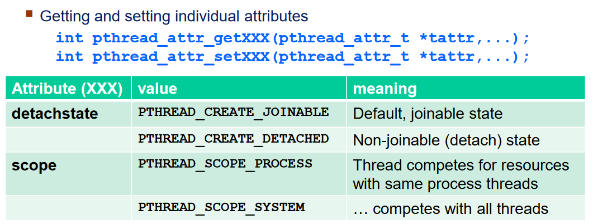
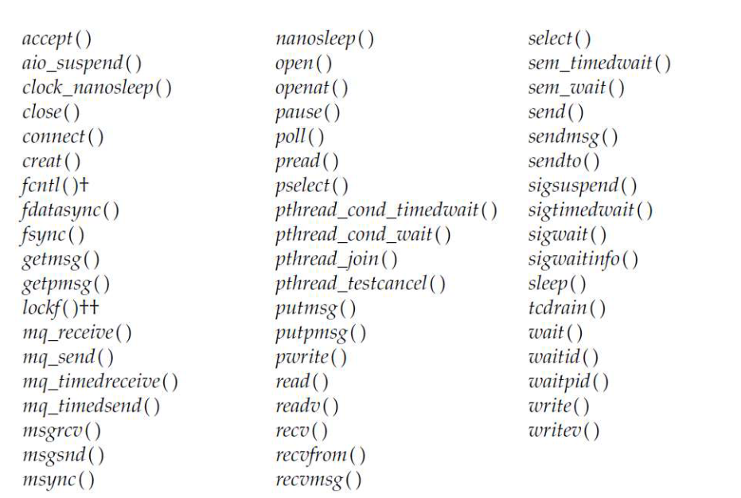

# Lab 4 - notatki

## Wątki
A single process can contain multiple threads, all of  which  are  executing  the
same  program.   These  threads share the same global memory (data and heap segments), but each thread has its
own stack (automatic variables).


Process-wide attributes (every thread has the same):
- PID
- Parent PID
- Process group ID
- File descriptors
- more: manpage 7 pthreads

Thread-wide attributes (distinct for each thread):
- thread ID (returned by pthread_create(), unique only within the process, may be reused after thread has been joined)
- signal mask (use pthread_sigmask in order to change it, sigmask is derived from the process)
- errno value
- more: manpage 7 phtreads

### Errors in threads
- most pthread functions return 0 on success or error number on failure, 
- error number returned has the same meaning as the errno number, 
- POSIX specifies that the function can never fail with the error EINTR.

### Thread function return value
Thread function returns address of return value, so the address should be
valid after the function returns. An alternative way: pthread_exit() call.

Remember to allocate on heap instead of the stack, when you return something. Heap is process-wide, stack is thread_wide.

### Types of pthreads


#### Joining threads
A thread of a process can wait for another thread of the same process:  
- if it knows TID of the awaited thread,
- the awaited thread **is not detached**.

#### Detached threads
- it is not required to join such a trhead, resources are automatically released on the termination,
- the detached thread cannot be joined back, process can't wait for it,
- as detached thread automatically release the resources on exit, therefore there is no way to determine its return value of detached thread function,
- to set them we can use pthread_create with attr set to detach (remember to destroy attr) or default pthread_create and than pthread_detach,
- attempting to detach an already detached thread results in unspecified behavior,
- main thread should end after all of the detached threads,
- what happens to a detached thread when main() exits? - standard defines it as undefined behaviour

#### Threads cancelling
man 3p pthread_cancel
man 3p pthread_setcancelstate

The thread cancellation (pthread_cancel func) mechanism allows a thread to terminate the execution of
any other thread in the process in a controlled manner.


- cancelability (`int pthread_setcancelstate(int state, int *oldstate)`) 
    - *PTHREAD_CANCEL_ENABLE* (default), 
    - *PTHREAD_CANCEL_DISABLE* 
- cancelability type (`int pthread_setcanceltype(int type, int *oldtype)`) 
    - *PTHREAD_CANCEL_DEFERRED* - cancellation requests are **held pending until a cancelation point is reached**,
    - *PTHREAD_CANCEL_ASYNCHRONOUS* - new or pending cancellatiotn requests may be acted upon **at any time**


### Cancellation points
POSIX specifies that certain functions must, and certain other functions may, be cancellation points.



### Cleanup routines
**Manpage:** man 3 phtread_cleanup_push

Cancellation of a thread can lead to inconsistent application state
(semaphores, mutexes and conditionals) or memory leaks and resource
waste.

Each thread has it's own stack of thread-cancellation clean-up handlers.
A clean-up handler is a function that is automatically executed when a thread is canceled (for example it might unlock the mutex).

pthread_cleanup_pop() function removes the routine at the top of the stack of clean-up handlers, and optionally executes it if execute is nonzero.


### Thrade-safe functions
A thread-safe function is one that can be safely (i.e., it will deliver the same results regardless of whether it is) called from multiple threads at the same time.

## Condition variables
Condition variables allow threads to wait until some condition
related to this variable is true.

Conditional variable always cooperates with a mutex.  

Let's say that we have 2 threads, there are theirs functions below. 
```c
pthread_mutex_t fuel_mtx;
pthread_cond_t fuel_cond;
int fuel = 0;

void *fill_fuel(void *args)
{
    for (int i = 0; i < 5; ++i) {
        pthread_mutex_lock(&fuel_mtx);
        fuel += 15;
        pthread_mutex_unlock(&fuel_mtx);
        // when you fill 15, send notification to the fuel_cond
        // shall unblock at least one thread
        pthread_cond_signal(&fuel_cond);
        // pthread_cond_broadcast - all threads
    }
}

void *car(void *args)
{
    pthread_mutex_lock(&fuel_mtx);
    // this condition is associated with fuel_cond
    // we call it predicate
    while (fuel < 40) {
        printf("No fuel\n");
        // wait for notification on the fuel_cond and 
        // unlock the mutex while you are waiting.
        // if you receive notification - lock the mutex and
        // check the condition in the while loop again 
        // unblocking of this function doesn't imply anything 
        // about the predicate 
        pthread_cond_wait(&fuel_cond, &fuel_mtx);
    }
    fuel -= 40;
    pthread_mutex_unlock(&fuel_mtx);
}
```

### Initialization and destroying
**Manpage:** man 3p pthread_cond_destroy

```c
// default initialization
pthread_cond_t cond = PTHREAD_COND_INITIALIZER;

// initialization with a function
int pthread_cond_init(
    pthread_cond_t *cond, // ptr to cond val to be initialized
    const pthread_condattr_t *mattr); // attributes which with cond should be initialized
    // if mattr is NULL => default initialization

// destroy cond (it is possible to reinitialize destroyed cond)
int pthread_cond_destroy(pthread_cond_t *cond) 
```
### Waiting
**Manapage:** man 3p pthread_cond_timedwait
```c
#include <pthread.h>

int pthread_cond_timedwait(
    pthread_cond_t *restrict cond,
    pthread_mutex_t *restrict mutex,
    const struct timespec *restrict abstime);

int pthread_cond_wait(
    pthread_cond_t *restrict cond,
    pthread_mutex_t *restrict mutex);
```

The pthread_cond_timedwait() and pthread_cond_wait() functions shall first
unlock the mutex and then block on a condition variable. 

These functions are cancelation points.

The pthread_cond_timedwait() function shall be equivalent to pthread_cond_wait(), 
except that an error (*ETIMEDOUT*) is returned if  the  absolute  time specified  by  abstime 
passes before the notification. The mutex is still being unlocked in such a case.

If  a signal is delivered to a thread waiting for a condition variable, upon return from the signal handler the thread resumes waiting for
the condition variable as if it was not interrupted, or it shall return zero due to spurious wakeup.

When a thread waits on a condition  variable,  having  specified  a  particular  mutex  to  either  the  pthread_cond_timedwait()  or  the
pthread_cond_wait()  operation, a dynamic binding is formed between that mutex and condition variable that remains in effect as long as at
least one thread is blocked on the condition variable. During this time, the effect of an attempt by any thread to wait on that  condition
variable  using  a  different  mutex is undefined.

### Broadcasting
**Manpage:** man 3p pthread_cond_broadcast
```c
#include <pthread.h>

int pthread_cond_broadcast(pthread_cond_t *cond);
int pthread_cond_signal(pthread_cond_t *cond);
```

These functions shall unblock threads blocked on a condition variable.

The pthread_cond_broadcast() function shall unblock all threads currently blocked on the specified condition variable cond.

The pthread_cond_signal() function shall unblock at least one of the threads that are blocked on the specified condition variable cond (if any threads are blocked on cond).

Jeśli kilka wątków jest zblokowanych na jakiejś cond val, to scheduler definiuje w jakiej 
kolejności będą one odblokowywane.

## Semafory
W semaforach (dowolnych) nie koneceptu właściciela. Dowolny proces/wątek może sygnalizować semafor.

Semafor zliczający, jest potrzebny gdy mamy kilka instancji danego resource. Jesli mamy jedną
korzystamy z semafora binarnego lub mutexa.

Zasadnicza różnica pomiędzy semaforem binarnym a mutexem jest taka, ze 
mutex ma ma swojego ownera - proces/wątek, który w danym momencie użył `lock()`.
Żadeń inny proces/wątek nie może użyć `unlock()` w tym czasie, musi to zrobić owner.

Wyobraźmy sobie, że mamy bibliotekę z 10 wolnymi pokojami do nauki (10 instancji resource). Semafor zna liczbę aktualnie wolnych pokoi. Każdy student (proces) prosi o dostęp do pokoju, jeśli liczba wolnych pokoi jest
większa niż 0, to czeka (blokuje się), wpp dostaje pokój, a licznik wolnych pokoi zostaje zmniejszony. Potem kiedy skończy się uczyć i wyjdzie z pokoju, licznik zostaje zwięskszony. 

Przykładowa implementacja semafora zliczającego (zakladając ze mamy systemowe funkcje `block()`, `wakeup(P)` oraz, że operacje wykonywane na `value` są atomowe).
```c
void wait(sem *s)
{
    s->value--;
    if (s->value < 0) {
        /* Lista FIFO (naiwne podejście) może być zastąpiona np. kolejką priorytetową
         aby zapobiegać głodzeniu (ang. starving) */
        s->L.push(P /* current proces */);
        block();
    }
}

void signal(sem* s)
{
    s->value++;
    if (s->value <= 0) {
        wakeup(s->L.pop());
    }
}
```

### Nazwane semafory
**Manpage:** man sem_open
Kiedy chcemy, by kilka procesów korzystało z tego samego semafora.

Używamy `sem_open()`, nazwa musi zaczynać się od `/` oraz nie znak `/` nie może wystąpić więcej razy niż raz na początku.

Musimy zamknąc korzystając z `sem_close()` oraz usunąć korzystając z `sem_unlink()`


```c
#include <semaphore.h>

sem_t *sem_open(const char *name, int oflag, ...);
```

The sem_open() function shall establish a connection between a named semaphore and a process, the process may reference the semaphore associated with name using the address returned from the call.
- O_CREAT - used if semaphore doesn't already exist, if it does exist then O_CREAT has no effect it requires arguments:
    - mode - permission bits,
    - value - set value of the semaphore,
- If O_EXCL and O_CREAT are set, sem_open() fails if the semaphore name exists.

Kiedy skończymy pracę z semaforem używamy `sem_close`.

Aby całkowicie pozbyć się semafora z sytemu używamu `sem_unlink` (Trwałość jądra).

### Nienazwane semafory
**Manpage:** man sem_init, man sem_destroy
```c
#include <semaphore.h>
int sem_init(
    sem_t *sem, 
    int pshared, // pshared = 0 then the semaphore is shared between threads of the calling process
                 // pshared != 0 then the semaphore is shared between processes
    unsigned value); // value of initialized semaphore

int sem_destroy(sem_t *sem);
```
Używamy kiedy chcemy, by jedynie wątki lub procesy dzieci mogły z niego korzystać, podobnie do mutexa.

Używamy `sem_init()` oraz na koniec `sem_destroy()`.

This semaphore shall remain usable until the semaphore is destroyed.

It is safe to destroy an initialized semaphore upon which no threads are currently blocked. The effect  of  destroying  a  semaphore  upon which other threads are currently blocked is undefined.

Semafor ma trwałość procesu (chyba że zostanie wcześniej zniszczony z użyciem `sem_destroy()`).

### Trywait i wait
**Manpage:** man sem_trywait
```c
#include <semaphore.h>

int sem_trywait(sem_t *sem);
int sem_wait(sem_t *sem);
```

The sem_trywait() function shall lock the semaphore referenced by sem only if the semaphore is currently not locked; that is, if the semaphore value is currently positive. Otherwise, it shall not lock the semaphore.

**The sem_wait() function is interruptible by the delivery of a signal**.

### Post
```c
#include <semaphore.h>

int sem_post(sem_t *sem);
```

The sem_post() function shall unlock the semaphore referenced by sem by performing a semaphore unlock operation on that semaphore.

## Barrier
In parallel computing, a barrier is a type of synchronization method. A barrier for a group of threads or processes in the source code means any thread/process must stop at this point and cannot proceed until all other threads/processes reach this barrier. 

### Inicjalizacja
```c
#include <pthread.h>

int pthread_barrier_destroy(pthread_barrier_t *barrier);
int pthread_barrier_init(pthread_barrier_t *restrict barrier,
    const pthread_barrierattr_t *restrict attr, unsigned count);
```

The pthread_barrier_destroy() function shall destroy the barrier referenced by barrier and release any resources used by the barrier.

The  pthread_barrier_init()  function  shall allocate any resources required to use the barrier referenced by barrier and shall initialize the barrier with attributes referenced by attr.

pthread_barrierattr_t pozwala na określenie liczby wątków, które muszą natrafić na barierę aby wznowić ich działanie.

### Synchronizacja
```c
#include <pthread.h>

int pthread_barrier_wait(pthread_barrier_t *barrier);
```

The pthread_barrier_wait() function shall synchronize participating threads at the barrier referenced  by  barrier.   The  calling  thread shall block until the required number of threads have called pthread_barrier_wait() specifying the barrier.


## Netcat

## Manpage

## Pytania do Karwowskiego
- czy jest jakiś sposób aby wyczekać detached thread i co sie dzieje w przypadku kiedy main thread zakonczy sie przed detached thread
